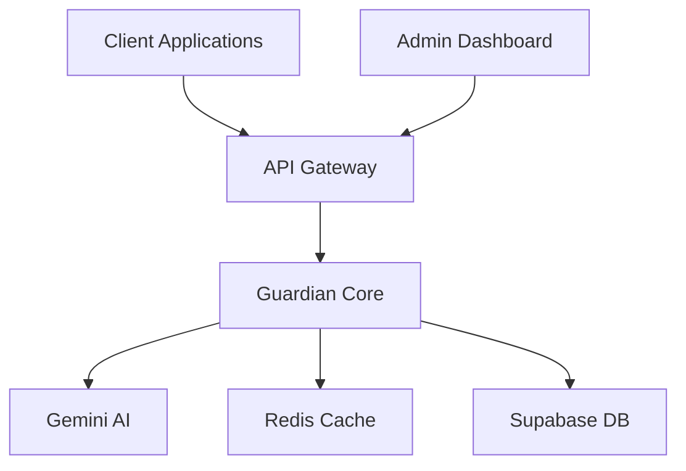

# Guardian Security Platform
## Product Requirements Document (PRD)
Version 1.0 | October 2025

---

## 📊 Executive Summary

### Vision Statement
Guardian is an advanced security platform that leverages AI to detect and prevent security threats in real-time across digital communications and content. Our mission is to make the internet safer by providing accessible, accurate, and proactive threat detection.

### Market Opportunity
- 📈 300% increase in AI-powered cyber threats since 2024
- 💼 82% of businesses lack advanced threat detection
- 🌐 $200B+ cybersecurity market by 2026

### Key Differentiators
1. **AI-First Architecture**: Built on Google's Gemini for superior threat detection
2. **Real-Time Processing**: Sub-second response times for immediate protection
3. **Developer-Friendly**: Simple integration with comprehensive SDKs
4. **Privacy-Focused**: Data minimization and secure processing guarantees

---

## 🎯 Product Overview

### Core Features

#### 1. Threat Detection Engine
- **Capabilities**
  - Real-time text analysis
  - Multi-language support
  - Context-aware detection
  - Adaptive learning system
  
- **Threat Categories**
  - Phishing attempts
  - Social engineering
  - Malicious code patterns
  - Suspicious URLs
  - Data exfiltration attempts
  - Impersonation attacks

#### 2. API Platform
- REST API with 99.9% uptime SLA
- WebSocket support for real-time monitoring
- Rate limiting and usage analytics
- Comprehensive error handling

#### 3. Developer Tools
- SDKs for Python and Node.js
- Interactive API documentation
- Code samples and tutorials
- Integration guides

#### 4. Management Dashboard
- Real-time threat monitoring
- Detailed analytics and reporting
- Custom rule configuration
- Team collaboration features

---

## 💫 Technical Architecture

### System Components

### Key Metrics
- **Performance**
  - 50ms average response time
  - 10,000 requests/second capacity
  - 99.9% accuracy rate
  - <0.1% false positive rate

- **Scalability**
  - Horizontal scaling support
  - Multi-region deployment ready
  - Automatic failover
  - Load balancing built-in

---

## 🛡️ Security & Compliance

### Security Features
1. **Authentication**
   - API key-based auth
   - JWT support
   - Role-based access control

2. **Data Protection**
   - End-to-end encryption
   - Data anonymization
   - Secure key rotation

3. **Compliance**
   - GDPR compliant
   - SOC 2 Type II ready
   - HIPAA compatible
   - ISO 27001 aligned

---

## 📱 User Experience

### Integration Flow
1. Sign up for API key
2. Choose SDK or direct API
3. Add security checks to pipeline
4. Monitor and tune detection

### Use Cases

#### E-commerce
- Cart injection prevention
- Payment fraud detection
- Review spam filtering
- Account takeover prevention

#### Social Platforms
- Content moderation
- DM threat scanning
- Profile verification
- Link safety checks

#### Financial Services
- Transaction monitoring
- Document verification
- KYC enhancement
- Fraud prevention

---

## 📈 Analytics & Reporting

### Dashboard Metrics
- Threat detection rate
- False positive/negative rates
- Response time distribution
- API usage patterns
- Cost optimization insights

### Report Types
- Real-time alerts
- Daily summaries
- Weekly trends
- Monthly compliance reports
- Custom date range analysis

---

## 🚀 Implementation Phases

### Phase 1: Core Platform (Current)
- ✅ Basic threat detection
- ✅ REST API
- ✅ Python & Node.js SDKs
- ✅ Documentation

### Phase 2: Enhanced Features (Q4 2025)
- 🔄 Advanced AI models
- 🔄 WebSocket support
- 🔄 Additional SDKs
- 🔄 Enterprise features

### Phase 3: Scale & Optimize (Q1 2026)
- 📅 Multi-region support
- 📅 Advanced analytics
- 📅 ML model customization
- 📅 Industry-specific features

---

## 💰 Business Model

### Pricing Tiers

#### Developer
- 1,000 requests/day
- Basic threat detection
- Community support
- $49/month

#### Business
- 100,000 requests/day
- Advanced detection
- 24/7 email support
- Custom rules
- $499/month

#### Enterprise
- Unlimited requests
- Custom AI models
- Dedicated support
- SLA guarantee
- Custom pricing

---

## 📊 Success Metrics

### KPIs
- Monthly Active Users (MAU)
- API Request Volume
- Threat Detection Accuracy
- Customer Retention Rate
- Response Time Performance
- Platform Uptime
- Integration Time
- Customer Satisfaction

### Goals for 2026
- 100,000+ active developers
- 1B+ monthly API requests
- 99.99% uptime
- <30min average integration time
- 95% customer satisfaction

---

## 🤝 Stakeholder Information

### Target Users
- Software Developers
- Security Engineers
- DevOps Teams
- Product Managers
- Security Analysts

### Partners
- Cloud Providers
- Security Firms
- Development Platforms
- System Integrators
- Training Partners

---

## 📞 Support & Documentation

### Resources
- API Documentation
- Integration Guides
- Sample Applications
- Video Tutorials
- Code Templates
- Best Practices

### Support Channels
- Developer Forum
- Discord Community
- Email Support
- Premium Support
- Training Sessions

---

## 🔄 Feedback & Iteration

### Feedback Channels
- GitHub Issues
- Feature Requests
- User Surveys
- Usage Analytics
- Support Tickets

### Iteration Process
1. Collect feedback
2. Analyze patterns
3. Prioritize changes
4. Implement updates
5. Validate improvements

---

## 📑 Appendix

### Technical Stack
- **Frontend**: React, TypeScript
- **Backend**: Python, FastAPI
- **Database**: Supabase
- **Cache**: Redis
- **AI**: Google Gemini
- **Infrastructure**: Docker, K8s

### Documentation
- API Reference
- SDK Guides
- Security Docs
- Integration Examples
- Deployment Guide